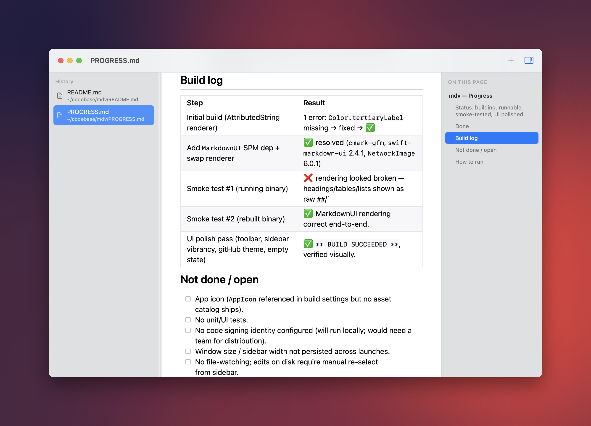

## Mdv: a macOS native Markdown viewer.

I built this in about 30 minutes of aggregate effort over the course
of an evening while yelling at people about zoning reform. 

## Features

* It renders Markdown. This is a totally solved problem in computer science and I used [gonzalezreal/swift-markdown-ui](https://github.com/gonzalezreal/swift-markdown-ui) to do it here.

* It keeps a durable history of the Markdown files you've viewed.

* You can associate it with the `.md` file type so it comes up with you click a Markdown file. So far so good here with the features, right?

* It supports TEXT SEARCH TECHNOLOGY. This is a feature that other Markdown viewers on the App Store don't support. I may patent it.

* It renders a TOC navigator as a sidebar.

* It may do other things I've forgotten about. 

## Installing

Type `make`.

## Here Are My Prompts, Roughly

> Install this macOS UI skill I found.

> Build me a Markdown viewer, in Swift, as a native macOS app. It should include a sidebar history of all the Markdown files I've viewed. Get it running with xcodebuild and use the computer-use MCP to make sure it's actually working.

> Use https://github.com/gonzalezreal/swift-markdown-ui to render Markdown.

> Write a PLAN.md and PROGRESS.md for all of this. [ed: I'm not showing them to you, they're embarassing]. 

> Does the markdown render look right to you? [reader: it did not] Evaluate it carefully, scroll it up and down too. 

> Rebuild, iterate until it's actually using the markdownui stuff.

> /macos-design clean up the UI; use computer-use MCP to verify your changes. Make it real nice.

> Does history survive restart? It should. I should be able to slide left to reveal a delete button for history items.
  
> Ok I need text search, standard macOS pattern, I only need normal text search nothing fussy.

> My big complaint is that it doesn't highlight the token or the line it found the match on, so it's hard to see where it is.

> Render a clickable table of content nav based on h1/h2/h3 headers in the markdown, as an additional, collapsible sidebar. use the macos-design skill to make it look good, and test with computer-use.

> Can I associate markdown files with this app so when i click them they come up in the viewer?

Then some boring packaging stuff, and also Claude figured out how to make the icon work. 

## What It Looks Like

I make it look real nice like.
