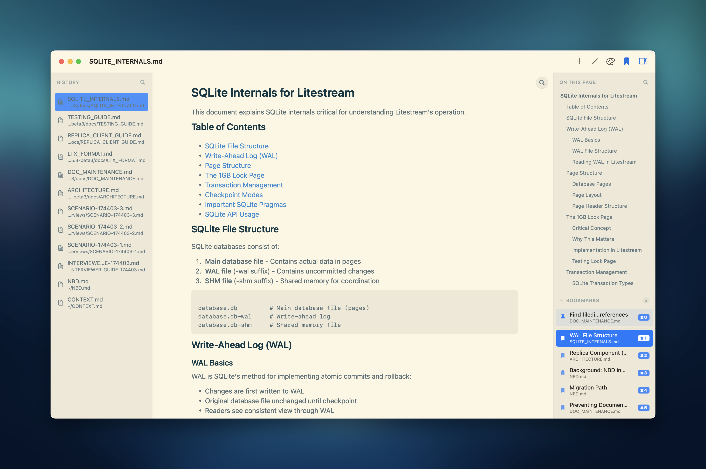

## Mdv: a macOS native Markdown viewer.

I built this in about 30 minutes of aggregate effort over the course
of an evening while yelling at people about zoning reform. It has since
grown a pile of features nobody asked for, which is how these things go.

## Features

* **It renders Markdown.** A totally solved problem in computer science, done
  here with [gonzalezreal/swift-markdown-ui](https://github.com/gonzalezreal/swift-markdown-ui)
  — patched and vendored, because the print pipeline needs a hook upstream
  doesn't have. GFM tables and task lists; code blocks highlighted by
  tree-sitter in bash, C, Go, JavaScript, Python, Ruby, Rust, TOML and YAML,
  with wrap and copy on hover; `diff` blocks tint their added and removed
  lines instead of pretending to be a syntax.

* **It renders Mermaid diagrams** (` ```mermaid ` fences) natively for the
  types BeautifulMermaid speaks — flowcharts, sequence, class, ER, state, XY
  charts — and through a bundled mermaid.js in a WKWebView for the rest:
  gantt, pie, timeline, journey, quadrant chart, requirement diagram. Hover
  for the toolbar: style picker, show source, copy, export a 2× PNG.

* **It renders LaTeX math** (`$…$` inline, `$$…$$` display) natively, no
  WebView, typeset in Latin Modern Math. Matrices, aligned environments,
  `\boxed{}`, and a long tail of symbols upstream's parser doesn't know.
  Right-click a display equation to copy its LaTeX. `\$` stays a dollar, and
  dollars in code stay code, so "$5 and $10" remains prose.

* **It prints.** ⌘P re-renders the document through the same pipeline the
  screen uses and hands it to the real macOS print panel, whose PDF dropdown
  is your Save-as-PDF. Text stays vector, formulas print as typeset math,
  diagrams print as diagrams — a fence that fails to render prints as its
  source rather than as an empty box — and page breaks land in the gutters
  between blocks instead of through a line of text. Printed type is set smaller than
  screen type, because 16pt reads as large print in a 7-inch column.

* **Frontmatter** (YAML or TOML metadata headers) renders as a properties
  table at the top of the document instead of leaking into the prose, and
  View → Show Frontmatter hides it entirely if you would rather see the file
  as it is.

* **It keeps a durable history** of the Markdown files you've viewed — all of
  them, until you swipe a row left and delete it. It remembers where you were
  scrolled to in each file, and it validates that anchor (and the file's
  mtime) before restoring it, so a file that changed under you doesn't fling
  you somewhere random.

* **It supports TEXT SEARCH TECHNOLOGY.** ⌘F finds in the current document,
  with highlights and a counter, like every text app shipped after 1998. ⌘⇧F
  searches every file in your history at once, out of an FTS5 index. Other
  Markdown viewers on the App Store somehow do not ship this. I may patent it.

* **It renders a TOC navigator** as a sidebar: h1/h2/h3 headings, click to
  jump, drag its edge to resize.

* **It has color/display themes** — nine of them, plus System — because I am a
  frustrated and untalented graphic designer and couldn't resist spending 30
  minutes having Claude and GPT argue back and forth with me about typography.
  There is a zoom (⌘= / ⌘-), a Smart Typography toggle (a few themes opt out),
  and a Load Remote Images toggle that is off by default, because a viewer
  shouldn't fetch arbitrary URLs on your behalf without being asked.

* **Links that go where you expect.** A sibling `.md` loads in place.
  `https://` goes to your browser, where it belongs. `#fragment` scrolls to
  that heading. A directory dropped on the icon opens its `README.md`, or the
  alphabetically-first markdown if there isn't one.

* **Bookmarks, across all files**, the first 5 of which are hotkeyed
  `CMD-[1-5]`, and a transient in-memory `CMD-0` placeholder. Every program
  must evolve until it manages bookmarks.

* **Editor integration.** ⌘E opens the current file in your external editor;
  File → Edit → Choose Editor… picks which one.

* **A command line tool.** `mdv FILE`, `mdv DIR`, or `mdv -` to read stdin —
  installed from the app menu (mdv → Install Command Line Tool…), which drops
  a symlink into `/usr/local/bin`. Yes, it asks for your password. No, it is
  not phoning home.

* **It may do other things I've forgotten about.**

## Getting around

The complete list lives in the app (⌘?). The ones you will actually use:

| Keys | Action |
| --- | --- |
| ⌘O · ⌘⇧O | open a file · open one in a new window |
| ⌘W · ⌘⇧W · ⌘⌥W | close the file · close the window · close everything |
| ⌘← · ⌘→ | back and forward through files you've opened, like a browser |
| ⌘⇧] · ⌘⇧[ | next and previous file down the history list (⌃⇥ · ⌃⇧⇥ too) |
| ⌘F · ⌘⇧F | find in this document · search all of history |
| ⌘P | print, or save as PDF |
| ⌘= · ⌘- | zoom in and out |
| ↓ ↑ · PgUp PgDn · Home End | scroll, without clicking into the text first |
| ⌘D · ⌘1–⌘5 · ⌘⇧0 · ⌘0 | bookmark this spot · jump to a slot · set placeholder · jump to it |
| ⌘E | edit the current file in your external editor |
| ⌃⌘S | show or hide the sidebar |

## Installing

Type `make`. That builds a debug `.app` into `./build/`, no Xcode project
required. `make run` launches it; `make install` copies it to
`/Applications`, registers it with LaunchServices, and symlinks the CLI into
`/usr/local/bin`; `make help` lists the rest — including the sign, notarize,
zip and release targets.

(Or download a release from Github.)

## What it's built out of

* [swift-markdown-ui](https://github.com/gonzalezreal/swift-markdown-ui),
  **vendored** in `Vendor/MarkdownUI` for one patch: upstream resolves inline
  images only in `View.task`, which SwiftUI's `ImageRenderer` never runs, so
  without it an inline formula would print as nothing at all. The patch is
  forty lines and `Vendor/MarkdownUI/README.md` explains it.
* [SwiftMath](https://github.com/mgriebling/SwiftMath), **vendored** in
  `Vendor/SwiftMath` for LaTeX, plus the symbols upstream's parser lacks.
* [BeautifulMermaid](https://github.com/lukilabs/beautiful-mermaid-swift) for
  the native diagram types, and mermaid.js for everything else it doesn't
  speak.
* [SwiftTreeSitter](https://github.com/ChimeHQ/SwiftTreeSitter) with vendored
  grammars, for code highlighting.
* SQLite (FTS5) for history, bookmarks, scroll positions and search.

## Here Are My Prompts, Roughly

> Install this macOS UI skill I found.

> Build me a Markdown viewer, in Swift, as a native macOS app. It should include a sidebar history of all the Markdown files I've viewed. Get it running with xcodebuild and use the computer-use MCP to make sure it's actually working.

> Use https://github.com/gonzalezreal/swift-markdown-ui to render Markdown.

> Write a PLAN.md and PROGRESS.md for all of this. [ed: I'm not showing them to you, they're embarassing]. 

> Does the markdown render look right to you? [reader: it did not] Evaluate it carefully, scroll it up and down too. 

> Rebuild, iterate until it's actually using the markdownui stuff.

> /macos-design clean up the UI; use computer-use MCP to verify your changes. Make it real nice.

> Does history survive restart? It should. I should be able to slide left to reveal a delete button for history items.
  
> Ok I need text search, standard macOS pattern, I only need normal text search nothing fussy.

> My big complaint is that it doesn't highlight the token or the line it found the match on, so it's hard to see where it is.

> Render a clickable table of content nav based on h1/h2/h3 headers in the markdown, as an additional, collapsible sidebar. use the macos-design skill to make it look good, and test with computer-use.

> Can I associate markdown files with this app so when i click them they come up in the viewer?

Then some boring packaging stuff, and also Claude figured out how to make the icon work. 

Then, later, the part where it stopped being a 30-minute evening:

> attempting to print Gantt chart results in crash

> printing seems to use huge font size; any way to make it more compact?

> LaTeX formulas don't render in print

> some formulas look fuzzy in print

*Note: this log is less authentic now since Josh & I fell into a hole of trying to (and succeeding at) building the best conceivable
Markdown viewer. But those prompts alone did get us to a Markdown viewer that was better than anything on the app store.*

## What It Looks Like



I make it look real nice like.
