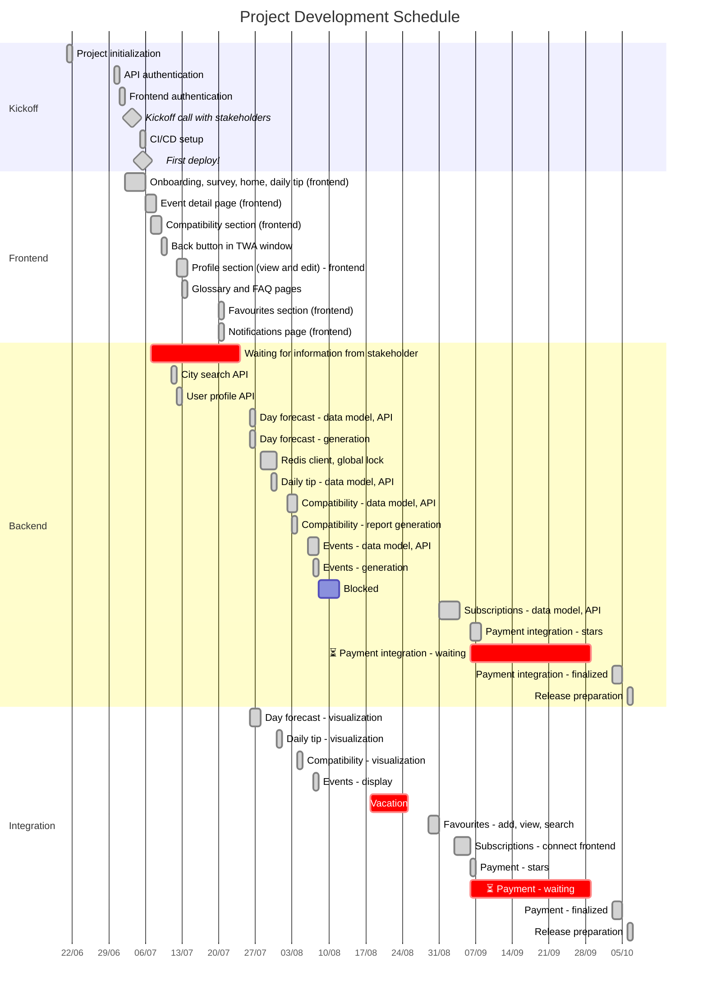

## Gantt diagram

```mermaid
gantt
    title Project Development Schedule
    dateFormat YYYY-MM-DD
    axisFormat %d/%m

    section Kickoff
    Project initialization         :done, 2025-06-21, 1d
    API authentication             :done, 2025-06-30, 1d
    Frontend authentication        :done, 2025-07-01, 1d
    Kickoff call with stakeholders :milestone, done, 2025-07-03, 1d
    CI/CD setup                    :done, 2025-07-05, 1d
    🚀 First deploy!               :milestone, done, 2025-07-05, 1d

    section Frontend
    Onboarding, survey, home, daily tip (frontend) :done, 2025-07-02, 2025-07-06
    Event detail page (frontend)                   :done, 2025-07-06, 2025-07-08
    Compatibility section (frontend)               :done, 2025-07-07, 2025-07-09
    Back button in TWA window                      :done, 2025-07-09, 1d
    Profile section (view and edit) - frontend     :done, 2025-07-12, 2d
    Glossary and FAQ pages                         :done, 2025-07-13, 1d
    Favourites section (frontend)                  :done, 2025-07-20, 1d
    Notifications page (frontend)                  :done, 2025-07-20, 1d

    section Backend
    Waiting for information from stakeholder :crit, 2025-07-07, 2025-07-24
    City search API                          :done, 2025-07-11, 1d
    User profile API                         :done, 2025-07-12, 1d
    Day forecast - data model, API           :done, 2025-07-26, 1d
    Day forecast - generation                :done, 2025-07-26, 1d
    Redis client, global lock                :done, 2025-07-28, 3d
    Daily tip - data model, API              :done, 2025-07-30, 1d
    Compatibility - data model, API          :done, 2025-08-02, 2d
    Compatibility - report generation        :done, 2025-08-03, 1d
    Events - data model, API                 :done, 2025-08-06, 2d
    Events - generation                      :done, 2025-08-07, 1d
    Blocked: waiting on stakeholder          :crit, 2025-08-08, 4d
    Subscriptions - data model, API          :done, 2025-08-31, 4d
    Payment integration - stars              :done, 2025-09-06, 2d
    ⏳ Payment integration - waiting         :crit, 2025-09-06, 2025-09-29
    Payment integration - finalized          :done, 2025-10-03, 2d
    Release preparation                      :done, 2025-10-06, 1d

    section Integration
    Day forecast - visualization    :done, 2025-07-26, 2025-07-28
    Daily tip - visualization       :done, 2025-07-31, 1d
    Compatibility - visualization   :done, 2025-08-04, 1d
    Events - display                :done, 2025-08-07, 1d
    Vacation                        :crit, 2025-08-18, 7d
    Favourites - add, view, search  :done, 2025-08-29, 2d
    Subscriptions - connect frontend:done, 2025-09-03, 3d
    Payment - stars                 :done, 2025-09-06, 1d
    ⏳ Payment - waiting            :crit, 2025-09-06, 2025-09-29
    Payment - finalized             :done, 2025-10-03, 2d
    Release preparation             :done, 2025-10-06, 1d
```
