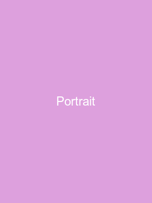

# Images

The `LocalImageProvider` (in `mdv/ContentView.swift`) handles four
shapes of image reference. Each section below should render a real
image except where noted.

## Relative path (same directory)

This is the most common pattern — an image stored next to the
markdown file.

## Relative path with subdirectory

A wider banner, deeper in the tree.

## Larger asset

This one's at full intrinsic size; the column will shrink it for
narrow themes (Sevilla) and let it sit at native size on wider
themes (Charcoal).

## Portrait orientation

Aspect ratio is preserved.

## Network image

Falls through to MarkdownUI's `DefaultImageProvider`.

## Inline data URI (1×1 pixel)

A 1×1 transparent PNG, base64-encoded inline. Should render as
essentially invisible (a 1px image), no error placeholder.

## Inline data URI (full image)

A real 100×100 PNG embedded directly in the markdown source — no
external file. This exercises the data-URI decoding path of
`LocalImageProvider`.

![inline icon](data:image/png;base64,iVBORw0KGgoAAAANSUhEUgAAAGQAAABkEAIAAACvEN5AAAAAIGNIUk0AAHomAACAhAAA+gAAAIDoAAB1MAAA6mAAADqYAAAXcJy6UTwAAAAGYktHRP///////wlY99wAAAAHdElNRQfqAgMQCzDKdSTdAAAE9UlEQVR42u3df1DTdRzH8c93G9uIkbBxIIyfIjvwUEhATZsnZJRGh6eHpcV1nP0Aos7qvLyoPC/PTPJMw11GclzUdWcdaVH8SI0Ykp45LyQVGFCbG1OSIWwwNvZdf6w/5nVdd9WbEXs9/trt832+n8/nnvfd977/jNNodLrGRgbwnxL4ewIwNyEsIIGwgATCAhIIC0ggLCCBsIAEwgISCAtIICwggbCABMICEggLSCAsIIGwgATCAhIIC0ggLCCBsIAEwgISCAtIICwggbCABMICEggLSCAsIIGwgATCAhIIC0ggLCCBsIAEwgISCAtIICwggbCABMICEggLSCAsIIGwgATCAhIIC0ggLCCBsIDEHA9r3fcLbNmOvIUJ/Rmr/T2XwDLHwwJ/QVhAQuTvCfhHSJo4RzqlXhJ7IP2ruNjQ+IgIZx3/xnTalSu/bTIYLkQNFfbmeI+UucXvB7+7Kk6pWXSv8qHQbxWvs3RWy8r6llm7zc2dVabMqxPuk/wOd710rUgvtpSkLC56YFtbjKGp65OsvPnDKceka0V68ZDlmL125Mh30b82dX1sz3VNOzb5ew9oBVxYnJqr5owF08m7lpfbW1ynHZKGQ70lnbnSHFGx+HS+POmDpWZ7jeuCQ9JzcGSeqapQlhK14rq13rHVdvTkij7VD0JpqyhbolujiFcu7uXULJadaS81su47zpLWFlEZ33ViQ5+os4k/5Klg8QX7kj/Kicwam9+6cGN7rjGv+x/O//8i4MKK1oW8J28Ke0SqCNnz5aBedK5hctS1e+o51swSGdMeMOq7n2aX2Ta2KFE7ryLy1F0bREWSXZ+1/RLU0eAUuJUuFWtmbPxNrdZ4vZtbX53csqzsnMRs6hEzxhh71XsWXaolX/+F7YjzUcdqdpwxVttzcIQ37VfVynXKQcZYHtvp752gFXD3WOFPBMfInrU/7zzqODVpcbVP7fYd1b9sLTPX6OusYrMofFxqkSmtrzjW2TKdF91K12HfIy3b7dxoOqdm1cwYViBJDrnlOzqe4QyauOb7zvQAL3fLBJVcquCsv/dgJgRcWPxe/hq/0qNhlzx/84fFbiX/KW9lGnaJff3nUa6c3cMe/uO1mqtmhjvOYvUEe976i08V+HsPZkLAhXW7cap/QuG9JZf2iY6LP/QdzdwfmbHAnv9SUtnSGmuoI8pm8l63xFlCU9ALvkdGqUJ0YW97tKyCxd1OmLp74kl/r2x2Cbiwhs7bVo3wI89MbhxvWiOPH1rSEZYg3Svbo9wRukVhziyOOpxcZawcOzFcZygba72psgldpZPbvY9Yw8elN2TK6OWyDrlQ3RH3eHppX471Z1OLI2V6s/Mpf69sdgm4sLw/gs2vDdRdHBYWclWC4s2u1ER1+f0lCS9mJv20/mb2QP1Vxa0h41l+i2elp+sbQf/OH1VCE7dVEF50JvUd9b4HY5Iyss4PPjaqvfF524gh+vJ9/l7TbMRpNDpdY+O//yIAXwF3xYKZgbCABMICEggLSCAsIIGwgATCAhIIC0ggLCCBsIAEwgISCAtIICwggbCABMICEggLSCAsIIGwgATCAhIIC0ggLCCBsIAEwgISCAtIICwggbCABMICEggLSCAsIIGwgATCAhIIC0ggLCCBsIAEwgISCAtIICwggbCABMICEggLSCAsIIGwgATCAhIIC0j8DkGzdTnj2mYEAAAAJXRFWHRkYXRlOmNyZWF0ZQAyMDI2LTAyLTAzVDE2OjExOjQ4KzAwOjAwhxJEuQAAACV0RVh0ZGF0ZTptb2RpZnkAMjAyNi0wMi0wM1QxNjoxMTo0OCswMDowMPZP/AUAAAAodEVYdGRhdGU6dGltZXN0YW1wADIwMjYtMDItMDNUMTY6MTE6NDgrMDA6MDChWt3aAAAAAElFTkSuQmCC)

## Missing reference

This one points at a file that does not exist. Should render the
"image not found" placeholder, not a blank space.

## Image inside a list

Make sure relative resolution still works in nested contexts.

- Item one
- Item two with an image: 
- Item three

## Image inside a blockquote

> Sometimes a quote needs a face attached.
>
> 
>
> — Anonymous, probably
