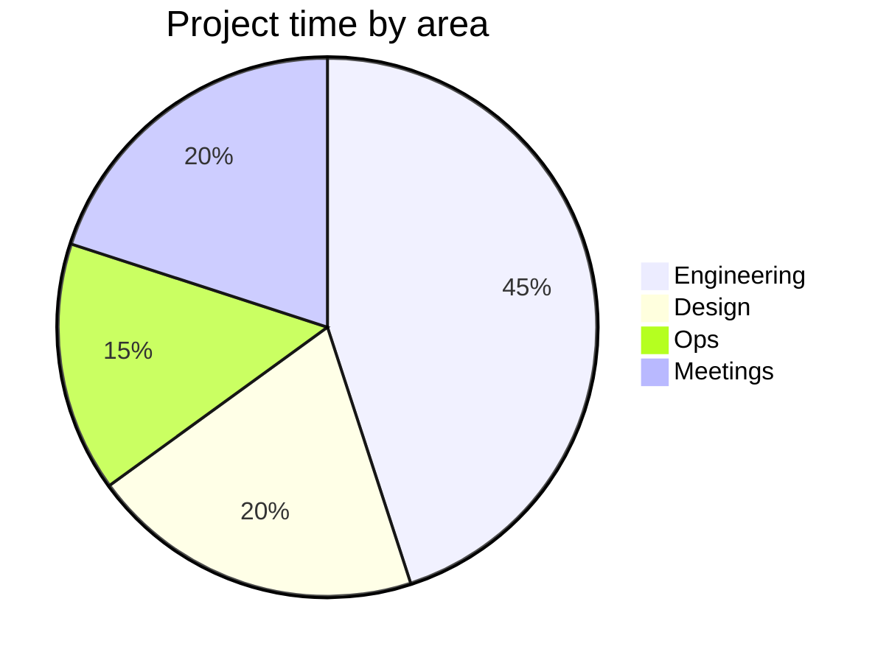
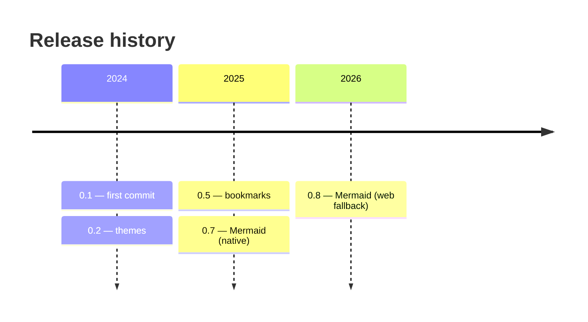
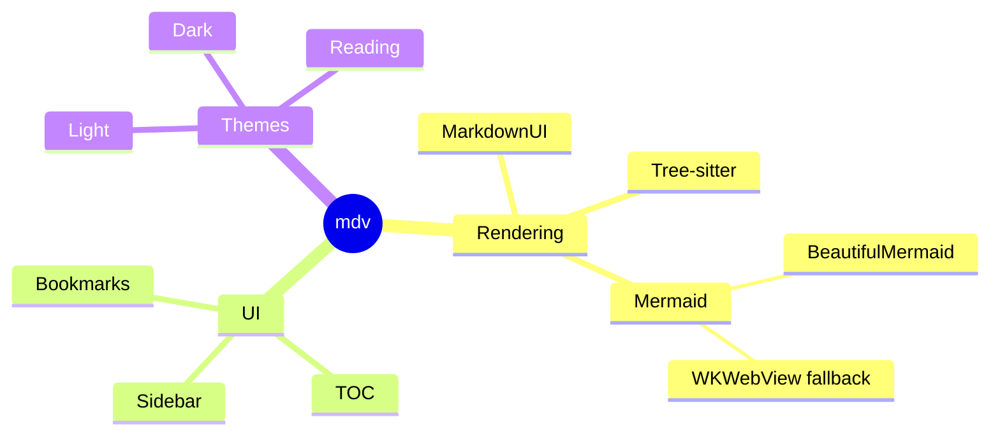
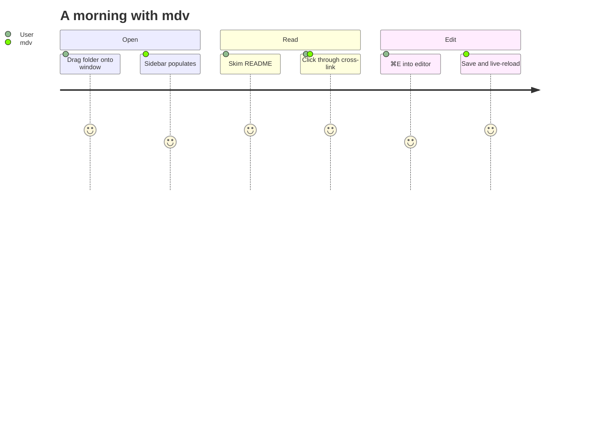
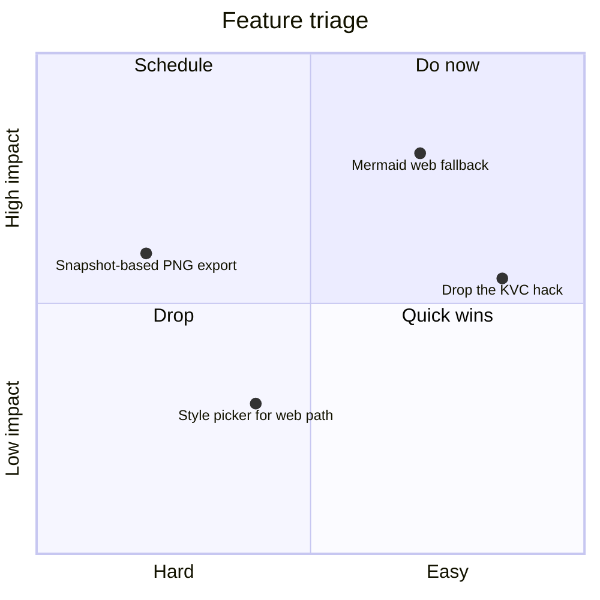
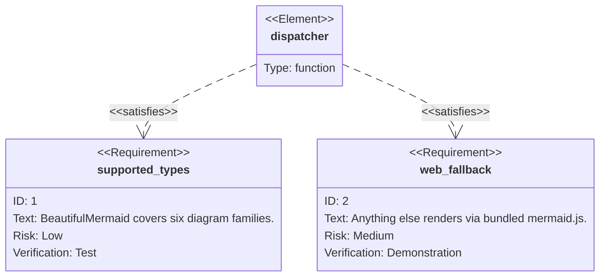
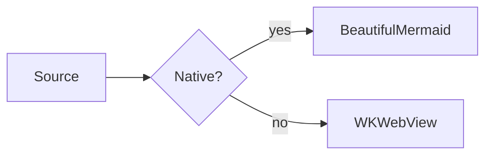

# Mermaid WKWebView fallback

A grab-bag of Mermaid diagram types BeautifulMermaid doesn't speak,
all of which should render via the bundled `mermaid.min.js` running in
a WKWebView. If any of them fall back to the "Mermaid diagram could
not be rendered" plate, the dispatcher in `MermaidRenderer.swift` is
miscategorising the keyword. If the diagram itself looks broken, that
points at `MermaidWebRenderer.swift` or the bundled mermaid.js
version pin in `build.sh`.

Companion to [gantt.md](gantt.md), which exercises a single longer
diagram. This file trades depth for breadth.

## Pie

## Timeline

## Mindmap

## User journey

## Quadrant chart

## Requirement diagram

## With a mermaid preamble

This block opens with a `%%{init}%%` directive *and* a comment
before the diagram keyword. The dispatcher should still see it as
a flowchart and route it through the native path; if it ends up in
the WKWebView fallback, `firstMermaidDirectiveLine` is broken.

